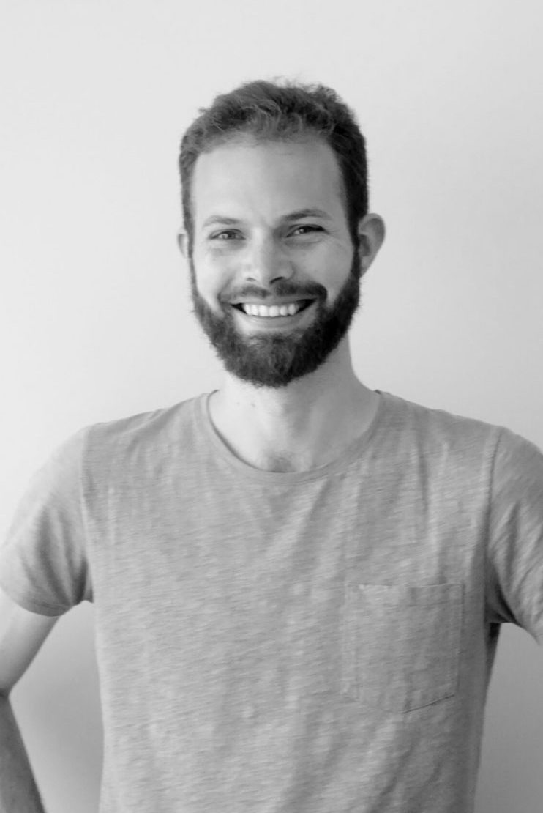

{:class="col one right"}

**Hey there! I'm Florian, a Machine Learning engineer and entrepreneur. I work on Generative AI and Reinforcement Learning. I'm based in 
French-speaking Switzerland.**

**General Intuition (2025 - current)** Founding member of the [General Intuition](http://generalintuition.ai/) research lab dedicated to video games and beyond. 

**NyxAI (2022 - current)** Co-founder of a Generative AI startup providing state-of-the-art tooling for image generation.
Our product [dreamlook.ai](https://dreamlook.ai/) allows users to finetune Stable Diffusion text-to-image models faster and cheaper by using TPUs.

**Cedille.ai (2021 - 2022)**
Trained and deployed [Cedille](https://github.com/coteries/cedille-ai), the largest language model for French at the time (6B), released under an open-source license (MIT), with a free and public playground.

**ML engineer at Coteries (2020 - 2022)**
I worked on ML projects, both for clients and internally, with a focus on NLP/NLG. Worked on the development, training and deployment of LLMs (10b+ parameters) leveraging large GPU and TPU clusters.

**AIcrowd (2019 - 2021)**
Lead researcher of the Flatland project, which investigates the use of ML (specifically Deep Reinforcement Learning) for railway planning, in partnership with the national railway companies from Switzerland, Germany and France (SBB, Deutsche Bahn, SNCF).

Co-organizer of the associated Flatland 2020 NeurIPS Challenge.

Workshop organizer:
- "Meet your Artificial Self: Generate text that sounds like you" at AMLD2020 
- "Climbing the Ladder: Reinforcement Learning in a Competitive Setting" at AMLD2020
- "Flatland: Multi-Agent Reinforcement Learning on Trains" at TheWebConference 2021

**Full Stack/Machine Learning Freelance (2017 - 2019)**
I worked as a full-stack web developer, using both the enterprise stack (Oracle/Hibernate/Spring) and the startup stack (React/Express/Firebase). Experience with Android native development, with both Java and Kotlin.

Selected mandates:
- Development of an Android application for a national operator, deployed to >1M users (2017)
- Setup of a 128 GPUs Kubernetes cluster on AWS for the NeurIPS 2018 Adversarial Vision Challenge competition (2018)
- Conception of a Deep Reinforcement Learning course for a private EPFL-based company (2019)

**Full Stack Software Engineer at Swissquote Bank (2015 - 2016)**
I worked on the development and maintenance of the "information" services of the bank including financial charting tools, search engines, alerts for prices and news - both backend (Java, J2EE, Spring, Stripes) and frontend (HTML5, CSS, JS).

**CERN Software Engineering Intern (2014)**
I built a web-based data visualization system for the ATLAS experiment. My tool was designed to ingest >1M events per second per node and summarize them in dashboards to be used by experts. It was my [EPFL Master thesis](https://masterscrat.github.io/documents/Florian_Laurent_CERN_Master_Thesis.pdf) and received maximal grade.

*Last updated October 16 2025*

---

	<a href="https://github.com/MasterScrat" target="_blank"><i class="fa fa-github-square"></i></a>
	<a href="https://www.reddit.com/user/MasterScrat/" target="_blank"><i class="fa fa-reddit-square"></i></a>
	<a href="https://twitter.com/MasterScrat" target="_blank"><i class="fa fa-twitter-square"></i></a>
	<a href="https://www.linkedin.com/in/florianlaurent/" target="_blank"><i class="fa fa-linkedin-square"></i></a>

